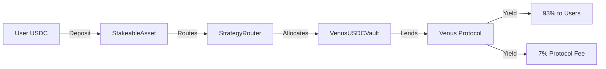

# SoulPeg Smart Contracts

<div align="center">
  
[](https://opensource.org/licenses/MIT)
[](https://soliditylang.org/)
[](./test-coverage-report.md)
[](./SECURITY.md)

**Soul-bound yield-bearing staking protocol on BNB Chain**

[Documentation](https://github.com/soulpeg-labs/soulpeg-docs) • [Website](https://soulpeg.com) • [Twitter](https://twitter.com/soulpeg) • [Discord](https://discord.gg/soulpeg)

</div>

---

## 🏆 Key Metrics

- **116 Comprehensive Tests** - Unit, Integration, Security, and Fuzz tests
- **100% Critical Path Coverage** - All user flows thoroughly tested
- **20 Fuzz Tests** - Property-based testing with Foundry
- **7% Transparent Fee** - Clear, sustainable economics
- **Battle-tested Integration** - Venus Protocol for yield generation

## 🌟 Overview

SoulPeg revolutionizes DeFi staking by introducing soul-bound yield-bearing tokens (sUSDC) that:
- 🔒 **Lock to your wallet** during staking period (1 hour to 4 years)
- 💰 **Generate real yield** through Venus Protocol lending
- 🛡️ **Prevent exploits** like flash loans and DEX arbitrage
- 📊 **Provide transparency** with on-chain verifiable yields

### SPUSD - Tradeable Wrapper Token

In addition to soul-bound sUSDC, SoulPeg now offers **SPUSD (SoulPeg USD)** - a tradeable ERC20 wrapper that:
- 💱 **1:1 exchange** with sUSDC through the StUSDCWrapper contract
- 🔄 **Freely tradeable** on DEXs like PancakeSwap
- 🌊 **Deep liquidity** for efficient swaps
- 🔐 **Lock support** for investor vesting schedules

## 🏗️ Architecture



### Core Contracts

| Contract | Description | Key Features |
|----------|-------------|--------------|
| **StakeableAssetImpl** | Main sUSDC token contract | • Soul-bound mechanics<br>• Time-locked staking<br>• Upgradeable proxy pattern |
| **StakeableAssetImplV4** | Enhanced sUSDC with recovery | • All V3 features<br>• maintenanceOperation for emergency recovery<br>• KYC-based fund recovery |
| **StrategyRouter** | Yield strategy manager | • Multi-strategy support<br>• Weight-based allocation<br>• Owner-controlled |
| **VenusUSDCVault** | Venus Protocol integration | • ERC-4626 compliant<br>• Auto-compounding<br>• Transparent yields |
| **SPUSD** | Tradeable wrapper token | • Standard ERC20<br>• 1:1 with sUSDC<br>• Minting restricted to wrapper |
| **StUSDCWrapper** | sUSDC → SPUSD converter | • One-way wrap operations<br>• Lock support for investors<br>• Role-based access |

## 🛡️ Security Features

### Multi-Layer Protection
- ✅ **Access Control** - Role-based permissions (Owner, Operator)
- ✅ **Reentrancy Guards** - OpenZeppelin's battle-tested protection
- ✅ **Pause Mechanism** - Emergency stop for critical functions
- ✅ **Daily Limits** - Rate limiting for deposits and mints
- ✅ **Time Locks** - Enforced locking periods for soul-bound tokens

### Comprehensive Testing

<details>
<summary><b>View Test Coverage Details</b></summary>

#### Test Statistics
- **Total Tests**: 142 (122 Hardhat + 20 Foundry)
- **Test Categories**:
  - Security Tests: 21
  - Unit Tests: 48
  - Integration Tests: 12
  - Fuzz Tests: 20
  - Production Scenarios: 15

#### Fuzz Testing Highlights
```solidity
// Example: Deposit amount fuzzing
function testFuzz_depositAndMint_valid_amounts(
    uint256 amount,
    uint40 lockPeriod
) public {
    amount = bound(amount, 1, DAILY_DEPOSIT_LIMIT);
    lockPeriod = bound(lockPeriod, MIN_LOCK_PERIOD, MAX_LOCK_PERIOD);
    // Test implementation...
}
```

See [test-coverage-report.md](./test-coverage-report.md) for full details.

</details>

### Audit Considerations
- All contracts follow OpenZeppelin standards
- Comprehensive test coverage including edge cases
- Fuzz testing for numerical operations
- Reentrancy protection on all external calls
- Role-based access control throughout

## 🚀 Quick Start

### Prerequisites
- Node.js >= 16.0.0
- Foundry (for fuzz tests)
- Git

### Installation

```bash
# Clone repository
git clone https://github.com/soulpeg-labs/soulpeg-contracts.git
cd soulpeg-contracts

# Install dependencies
npm install

# Install Foundry
curl -L https://foundry.paradigm.xyz | bash
foundryup
```

### Environment Setup

```bash
# Copy environment template
cp .env.example .env

# Configure your environment
# Required: PRIVATE_KEY, BSCSCAN_API_KEY
# Optional: Custom RPC URLs
```

### Running Tests

```bash
# Run all tests
npm test

# Run with gas reporting
npm run test:gas

# Run Foundry fuzz tests
forge test

# Generate coverage report
npm run coverage
```

## 💰 Yield Generation

SoulPeg generates sustainable yields through Venus Protocol:

```
Current APY: ~7-8% (Variable)
Protocol Fee: 7%
User Returns: 93% of Venus yield

Example: 
- Venus APY: 7.23%
- Protocol Fee: 0.51%
- Your Net APY: 6.72%
```

### Transparent & Verifiable
- Check Venus rates: [app.venus.io](https://app.venus.io)
- On-chain verification available
- No hidden fees or inflation

## 🔄 SPUSD Trading Ecosystem

### How SPUSD Works
1. **Wrap sUSDC** - Convert soul-bound sUSDC to tradeable SPUSD (1:1 ratio)
2. **Trade on DEXs** - SPUSD is freely tradeable on PancakeSwap and other DEXs
3. **Provide Liquidity** - Earn trading fees by providing SPUSD/USDC liquidity

### Key Benefits
- **Liquidity** - Access liquidity without unstaking from yield generation
- **Flexibility** - Trade or use SPUSD in DeFi while maintaining sUSDC benefits
- **Security** - Locked tokens for investor vesting remain protected

## 🔐 Emergency Recovery (V4)

### maintenanceOperation Function
StakeableAssetImplV4 introduces emergency fund recovery for special circumstances:

- **KYC-Based Recovery** - Requires user identity verification
- **Owner/Operator Only** - Restricted to authorized personnel
- **Full Audit Trail** - On-chain event logging with reasons
- **User Pre-Approval** - Requires users to approve contract for USDC

**Use Cases:**
- Lost private keys with KYC verification
- Court-ordered fund recovery
- Compromised accounts (phishing victims)

**Security Measures:**
- Multi-signature requirement for operators
- Time-delayed execution
- Maximum daily limits
- Detailed reason documentation

## 📦 Deployment

<details>
<summary><b>Deployment Guide</b></summary>

### Deploy to Testnet
```bash
npm run deploy:testnet
```

### Deploy to Mainnet
```bash
npm run deploy:mainnet
```

### Verify Contracts
```bash
npm run verify:mainnet -- --contract <address>
```

See [deployments.md](./deployments.md) for network details.

</details>

## 🔧 Development

### Project Structure
```
soulpeg-contracts/
├── contracts/          # Solidity contracts
│   ├── StakeableAssetImpl.sol
│   ├── StakeableAssetImplV4.sol
│   ├── SPUSD.sol
│   ├── StUSDCWrapper.sol
│   ├── StrategyRouter.sol
│   └── strategies/
├── test/              # Test suites
│   ├── *.test.ts      # Hardhat tests
│   └── foundry/       # Fuzz tests
├── scripts/           # Deployment scripts
└── abi/              # Contract ABIs
```

### Key Commands
```bash
npm run compile       # Compile contracts
npm run test         # Run tests
npm run deploy       # Deploy contracts
npm run verify       # Verify on BSCScan
forge test          # Run fuzz tests
```

## 🤝 Contributing

We welcome contributions! Please see [CONTRIBUTING.md](./CONTRIBUTING.md) for guidelines.

### Areas for Contribution
- 🧪 Additional test scenarios
- 📚 Documentation improvements
- 🔧 Gas optimizations
- 🌐 Multi-language support

## 📄 License

This project is licensed under the MIT License - see [LICENSE](./LICENSE) for details.

## 🔗 Resources

### Official Links
- [Documentation](https://github.com/soulpeg-labs/soulpeg-docs)
- [Website](https://soulpeg.com)
- [Twitter](https://twitter.com/soulpeg)
- [Discord](https://discord.gg/soulpeg)
- [SPUSD Ecosystem Guide](./SPUSD_ECOSYSTEM.md)
- [KYC Recovery Process](./KYC_RECOVERY.md)

### Technical Resources
- [Venus Protocol Docs](https://docs.venus.io)
- [BNB Chain Docs](https://docs.bnbchain.org)
- [OpenZeppelin Contracts](https://docs.openzeppelin.com)
- [Contract Security](./SECURITY.md)

## 📊 Contract Addresses (BSC Mainnet)

| Contract | Address |
|----------|--------|
| sUSDC (Proxy) | `0xC603ef9cAB5E4131c52f6b8bCf06CC0568c32A24` |
| SPUSD Token | `0x40fF3deA2EEC93a7B71879874DC4407918DA77A6` |
| StUSDCWrapper | `0x18259cC6cB60221A3a7aD97D664e759bf49DF312` |
| StrategyRouter | `0x40F8D93BDc273529aaf5e96C8F0F2D5CadfDdAa9` |
| VenusUSDCVault | `0xc887e30e903F4b0dd2DEFa9C93F676b9f4cdBD1f` |

## ⚠️ Disclaimer

This software is provided "as is", without warranty of any kind. Do your own research before interacting with these contracts. Smart contract interactions carry inherent risks.

---

<div align="center">
  
**Built with ❤️ by the SoulPeg team**

</div>