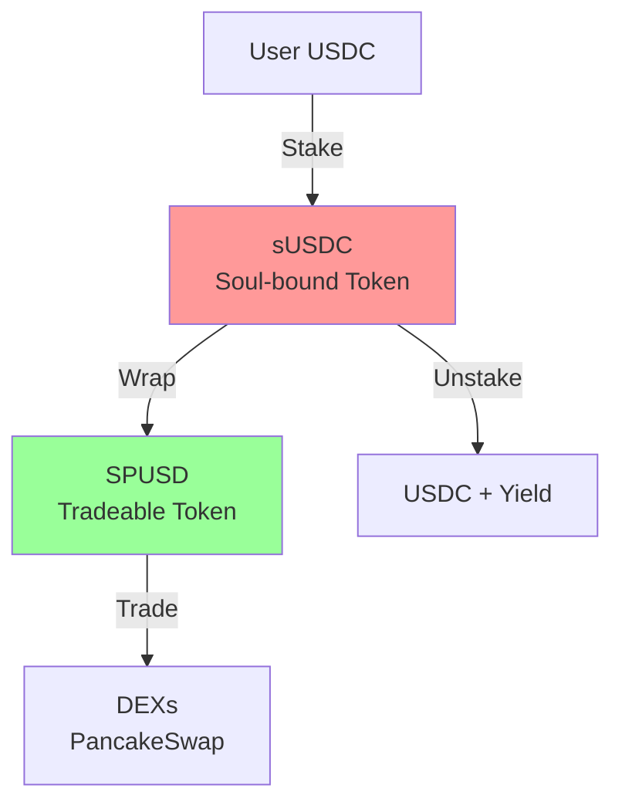

# SPUSD Ecosystem Documentation

## Overview

SPUSD (SoulPeg USD) is a tradeable ERC20 wrapper token for soul-bound sUSDC, enabling liquidity while maintaining yield generation through the underlying staking mechanism.

## Architecture



## Key Components

### 1. SPUSD Token Contract
- **Purpose**: Standard ERC20 token representing wrapped sUSDC
- **Features**:
  - Minting restricted to wrapper contract
  - Built-in lock checking for vested tokens
  - 1 billion token supply cap
  - ERC20Permit support

### 2. StUSDCWrapper Contract
- **Purpose**: Facilitates one-way conversion from sUSDC to SPUSD
- **Key Functions**:
  - `wrap()`: Convert sUSDC to SPUSD (1:1)
  - `wrapAndLock()`: Mint locked SPUSD for investors
  - `getLockInfo()`: Check lock status

## User Flows

### Regular User Flow
```
1. User stakes USDC → receives sUSDC (soul-bound)
2. User wraps sUSDC → receives SPUSD (tradeable)
3. User trades SPUSD on DEXs or uses in DeFi
4. User can trade SPUSD for USDC on DEX to exit position
```

### Investor Flow
```
1. Project wraps and locks SPUSD for investor
2. Investor receives locked SPUSD tokens
3. Investor can trade unlocked portion only
4. After vesting period, all tokens unlock
5. Investor can trade SPUSD freely on DEXs
```

## Trading SPUSD

### Available Markets
- **PancakeSwap**: Primary liquidity pool (SPUSD/USDC)
- **Future**: Additional DEX integrations planned

### Liquidity Provision
- Provide SPUSD/USDC liquidity on PancakeSwap
- Earn 0.17% trading fees (0.25% total, 0.08% to protocol)
- No impermanent loss risk due to stable peg

### Price Stability
- Maintained through arbitrage opportunities
- 1:1 backing with sUSDC ensures price floor
- Wrapper contract enables instant arbitrage

## Security Features

### Token Security
- **Supply Cap**: 1 billion SPUSD maximum
- **Role-Based Access**: Only wrapper can mint/burn
- **Lock Protection**: Prevents transfer of vested tokens

### Wrapper Security
- **Reentrancy Protection**: OpenZeppelin ReentrancyGuard
- **Access Control**: Owner and operator roles
- **1:1 Backing**: Always fully backed by sUSDC

## Integration Guide

### For Developers

#### Adding SPUSD to Your DApp
```javascript
// Token addresses (BSC Mainnet)
const SPUSD_ADDRESS = "0x40fF3deA2EEC93a7B71879874DC4407918DA77A6";
const WRAPPER_ADDRESS = "0x18259cC6cB60221A3a7aD97D664e759bf49DF312";

// ABI imports
import SPUSD_ABI from "./abi/SPUSD.json";
import WRAPPER_ABI from "./abi/StUSDCWrapper.json";
```

#### Wrapping sUSDC
```javascript
// 1. Approve wrapper for sUSDC
await sUSDC.approve(WRAPPER_ADDRESS, amount);

// 2. Call wrap function
await wrapper.wrap(amount);
```

#### Checking Lock Status
```javascript
const [lockedAmount, unlockTime] = await wrapper.getLockInfo(userAddress);
const isLocked = unlockTime > Date.now() / 1000;
```

### For Liquidity Providers

1. **Obtain SPUSD**: Wrap sUSDC or buy on DEX
2. **Obtain USDC**: Standard stablecoin
3. **Add Liquidity**: Use PancakeSwap interface
4. **Earn Fees**: 0.17% of all trades

## Use Cases

### 1. Liquidity Access
- Access funds without losing staking yield
- Emergency liquidity for staked positions
- Maintain yield while having tradeable assets

### 2. Trading and Arbitrage
- Trade SPUSD/USDC pairs
- Arbitrage opportunities when off-peg
- Integration with DeFi protocols

### 3. Vesting Implementation
- Lock tokens for team/investors
- Transparent on-chain vesting
- Partial liquidity during vesting

### 4. Collateral in DeFi
- Use as collateral in lending protocols
- Participate in yield farming
- Liquidity pool rewards

## FAQs

**Q: What happens to my yield when I wrap sUSDC?**  
A: Once wrapped to SPUSD, the underlying sUSDC is locked in the wrapper. To access USDC, trade SPUSD on DEXs.

**Q: Can I lose money trading SPUSD?**  
A: SPUSD maintains a 1:1 peg with USDC through arbitrage. Significant price deviations are temporary.

**Q: What if I have locked SPUSD?**  
A: You can trade the unlocked portion. The contract prevents transferring locked tokens.

**Q: Is SPUSD audited?**  
A: The contracts follow OpenZeppelin standards and have comprehensive test coverage.

## Contract Addresses

| Contract | BSC Mainnet Address |
|----------|-------------------|
| SPUSD | `0x40fF3deA2EEC93a7B71879874DC4407918DA77A6` |
| StUSDCWrapper | `0x18259cC6cB60221A3a7aD97D664e759bf49DF312` |
| sUSDC (Proxy) | `0xC603ef9cAB5E4131c52f6b8bCf06CC0568c32A24` |

## Future Developments

1. **Cross-chain Bridge**: Enable SPUSD on other chains
2. **Additional DEX Listings**: Expand trading venues
3. **DeFi Integrations**: Lending protocol support
4. **Governance Features**: Community-driven decisions

---

*For technical support, visit our [Discord](https://discord.gg/soulpeg)*